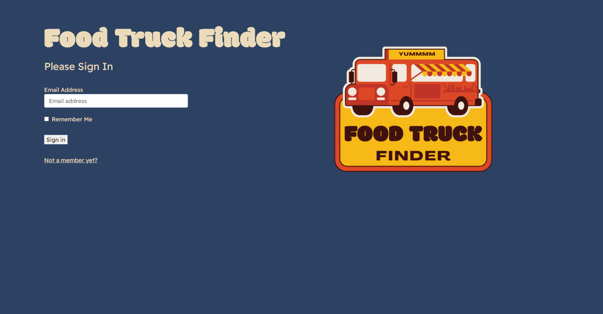

## Food Truck Finder API

### Prerequisites

1. Install json-server

```sh
npm i json-server
```

<p style="font-size: 20px; font-weight: 500;">Food Truck Finder Repository</p>

<a href="https://github.com/MelissaCFox/Food-Truck-Finder" target="_blank" rel="noreferrer"></a>

### Installation

<p style="font-size: 16px; font-weight: 500;">In order to demo the Food Truck Finder application, you will need to clone this repository and login as an existing user.</p>


1. Clone this repository and change to the directory in the terminal.

```sh
git@github.com:MelissaCFox/food-truck-finder-api.git
cd food-truck-finder-api
```

2. Run the server.

```sh
json-server -w database.json -p 8088
```

3. Launch the application from a new terminal tab (step 3 from installation portion of Food-Truck-Finder readme)

```sh
cd food-truck-finder
npm start
```
### Demo login credentials
- Login with user@demo.com for user view
- Login with truck@owner.com for owner view


## Author Info

- Github - [MelissCFox](https://github.com/MelissaCFox)
- LinkedIn - [Melissa Fox](https://www.linkedin.com/in/melissacfox/)